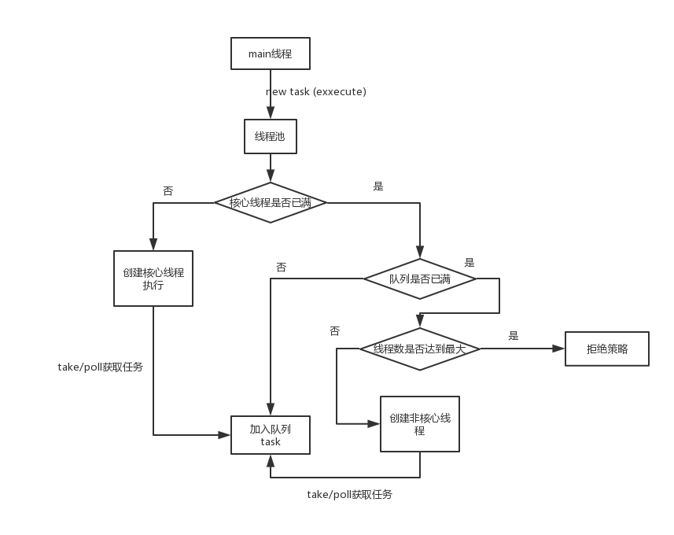
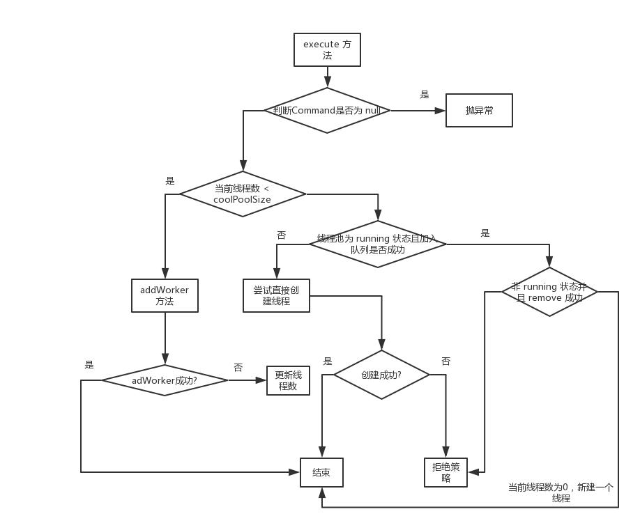

## 正文

近两天比较忙，ThreadPool 是近期看的一个点，一直没抽时间写一篇博客，主要对技术一直比较有兴趣，所以还是抽空写了一篇，巩固一下。

### 来了解一下线程池总体的执行流程

我大致画了一张图



大致流程就是：

- 执行 `execute` 方法，检查核心线程数是否小于定义的核心线程数量，如果小于，则直接创建一个新的线程执行任务
- 当前线程数量已经大于等于核心线程数，那么就去检查定义的队列是否已经满了，如果队列还没有满，就将任务包装放入队列中
- 如果当前队列已经满了，那么就检查线程数是否小于最大线程数，如果小于，就新建线程至执行任务
- 如果已经超过了最大线程数，那么就执行拒绝策略


一如既往，来一点简单的用例，帮助理解，要学一样东西的源码，一定要先从简单的用法入手
### 最简单的用例

```java
 public static void main(String[] args) {
        ExecutorService executorService = Executors.newFixedThreadPool(2);
        
        executorService.execute(() -> {
            System.out.println("我是线程池中被执行的");
        });
    }
```
果然，用法简单的工具，往往实现就会比较复杂（实际上也不是很复杂），上面就是一个最简单的线程池的用法，我们使用 `Executors` 这个工具类来新建一个线程池，（Ps：一般带 `s` 的类基本都是工具类，如 `Arrays`，`Collections` 等）
我们深入到创建线程池的这个方法中

```java
   public static ExecutorService newFixedThreadPool(int nThreads) {
        return new ThreadPoolExecutor(nThreads, nThreads,
                                      0L, TimeUnit.MILLISECONDS,
                                      new LinkedBlockingQueue<Runnable>());
    }
```

可以看到，这个工具类实际上非常简单，就是帮你 `new` 了一个 `ThreadPoolExecutor`，也就是本博文的主题，可以看到，`ThreadPoolExecutor` 的入参实际上是比较复杂的，我们不解释 `newFixedThreadPool` 这个线程池的特性，
一会讲了这些参数的作用以及原理就自然而然的明白了。

进入到 `ThreadPoolExecutor` 方法中，由于构造器入参比较复杂，我找了一个最全的构造器来讲解入参的参数作用

```java
     public ThreadPoolExecutor(int corePoolSize,
                               int maximumPoolSize,
                               long keepAliveTime,
                               TimeUnit unit,
                               BlockingQueue<Runnable> workQueue,
                               ThreadFactory threadFactory,
                               RejectedExecutionHandler handler) {
         if (corePoolSize < 0 ||
             maximumPoolSize <= 0 ||
             maximumPoolSize < corePoolSize ||
             keepAliveTime < 0)
             throw new IllegalArgumentException();
         if (workQueue == null || threadFactory == null || handler == null)
             throw new NullPointerException();
         this.acc = System.getSecurityManager() == null ?
                 null :
                 AccessController.getContext();
         this.corePoolSize = corePoolSize;
         this.maximumPoolSize = maximumPoolSize;
         this.workQueue = workQueue;
         this.keepAliveTime = unit.toNanos(keepAliveTime);
         this.threadFactory = threadFactory;
         this.handler = handler;
     }
```

- corePoolSize: 定义核心线程的数量
- maximumPoolSize: 池内最大线程的数量（会保证不小于0，否则会抛异常）
- keepAliveTime: 线程在线程池中，无任务（空闲）闲置的最大时间，超过就会被 kill
- unit: 时间类型
- workQueue: 工作的队列
- threadFactory: 线程工厂，用于生成线程
- handler: 拒绝策略处理器

> 看一下 ThreadPoolExecutor 中的一些变量

```java
    private final AtomicInteger ctl = new AtomicInteger(ctlOf(RUNNING, 0));
    private static final int COUNT_BITS = Integer.SIZE - 3;
    private static final int CAPACITY   = (1 << COUNT_BITS) - 1;
    
    private static final int RUNNING    = -1 << COUNT_BITS;
    private static final int SHUTDOWN   =  0 << COUNT_BITS;
    private static final int STOP       =  1 << COUNT_BITS;
    private static final int TIDYING    =  2 << COUNT_BITS;
    private static final int TERMINATED =  3 << COUNT_BITS;
    
    private static int runStateOf(int c)     { return c & ~CAPACITY; }
    private static int workerCountOf(int c)  { return c & CAPACITY; }
    private static int ctlOf(int rs, int wc) { return rs | wc; }
```

`ctl` 这个变量包含了两层数据，高三位保存的是线程的状态（`runStateOf` 来计算线程状态） ，低二十九位保存的是线程的数量（`workerCountOf` 来计算线程数量）
`ctlOf` 用户计算 `ctl`， 通过 `runState` 和 `workerCount` 两个参数来或操作
`RUNNINF` 该状态的线程池会接收新任务，也会处理在阻塞队列中等待处理的任务
`SHUTDOWN` 该状态的线程池不会再接收新任务，但还会处理已经提交到阻塞队列中等待处理的任务
`STOP` 该状态的线程池不会再接收新任务，不会处理在阻塞队列中等待的任务，而且还会中断正在运行的任务
`TIDYING` 所有任务都被终止了，workerCount为0，为此状态时还将调用terminated()方法
`TERMINATED` terminated 方法处理后，进入此状态

> 进入 execute 方法

```java
 public void execute(Runnable command) {
        if (command == null)
            throw new NullPointerException();
     
        int c = ctl.get();
        //  如果当前线程数小于核心线程数量
        if (workerCountOf(c) < corePoolSize) {
            if (addWorker(command, true))
                return;
            c = ctl.get();
        }
        //  当前执行的线程数大于核心线程，就尝试放到队列中
        if (isRunning(c) && workQueue.offer(command)) {
            // todo 我们仍需要一个双重校验去确认是否应该新建一个线程（因为可能存在有些线程在我们上次检查后死了）
            int recheck = ctl.get();
            if (! isRunning(recheck) && remove(command))
                reject(command);
            //  如果当前线程数是0， 那么就新建一个无任务的线程
            else if (workerCountOf(recheck) == 0)
                addWorker(null, false);
        }
        //  队列满了就尝试继续创建线程，创建失败就启动拒绝策略
        else if (!addWorker(command, false))
            reject(command);
    }
```

看一下 `execute` 的执行流程图



可以清晰的看到，在 `execute` 方法中，就存在着非常清晰的逻辑，如何处理这个任务，如何拒绝这个任务等。

梳理一下 `execute` 方法的执行流程

- 1.一个任务来了，调用 `execute` 方法，首先判断任务是否为空，为空就直接抛异常了，否则进入下一步操作
- 2.通过 `ctl` 变量，来判断当前线程数和核心线程数的关系，小于核心线程数的话，就直接调用 `addWorker` 添加任务创建线程，添加成功直接 `return` 返回，否则就进入下面的操作
- 3.再次获取当前的 `ctl` 值，判断当前状态是否为 `running`， 是的话就尝试将任务加入队列，加入成功后，再次确认当前的状态是否是 `running` 状态，如果非 `running` 状态并且将任务从队列中去除成功，调用拒绝策略
否则，就判断当前线程数是否为0，为0的话就需要创建一个线程来执行队列中的任务
- 4.若上述条件都不满足（队列满了且线程数大于核心线程），就尝试直接添加任务新建线程，成功就方法返回，失败则调用拒绝策略

> 进入 addWorker 方法

```java
  private boolean addWorker(Runnable firstTask, boolean core) {
        retry:
        for (;;) {
            int c = ctl.get();
            // todo 获取线程池的状态
            int rs = runStateOf(c);

            // Check if queue empty only if necessary.
            // todo 状态非 running 并且 （状态不等于 SHUTDOWN） 或者 （状态是 SHUTDOWN，但是 firstTask 不为 null。此时应该拒绝添加新任务） 或者 （SHUTDOWN 状态且 task为空，但是队列是空的，这个时候没必要新建线程）
            if (rs >= SHUTDOWN &&
                ! (rs == SHUTDOWN &&
                   firstTask == null &&
                   ! workQueue.isEmpty()))
                return false;

            for (;;) {
                // todo 获取线程数量
                int wc = workerCountOf(c);
                // todo 如果线程数量大于最大值
                if (wc >= CAPACITY ||
                        // todo （核心线程）线程数量大于核心数量，线程数量大于配置最大值，返回 false
                    wc >= (core ? corePoolSize : maximumPoolSize))
                    return false;
                // todo 如果将线程数量 +1 成功，就跳出整个死循环，进入下一步操作
                if (compareAndIncrementWorkerCount(c))
                    break retry;
                // todo 再次读取 ctl
                c = ctl.get();  // Re-read ctl
                // todo 如果和外层获取的状态不一致，则跳出内层循环，继续外层循环
                if (runStateOf(c) != rs)
                    continue retry;
                // else CAS failed due to workerCount change; retry inner loop
            }
        }

        boolean workerStarted = false;
        boolean workerAdded = false;
        Worker w = null;
        try {
            // todo worker 实现了AQS 和 Runnable，会将外部传进来的 task 包装成 worker，并将本身通过线程 工厂构造成一个thread，存在worker里面
            w = new Worker(firstTask);
            final Thread t = w.thread;
            if (t != null) {
                // todo 调用重入锁
                final ReentrantLock mainLock = this.mainLock;
                mainLock.lock();
                try {
                    // Recheck while holding lock.
                    // Back out on ThreadFactory failure or if
                    // shut down before lock acquired.
                    int rs = runStateOf(ctl.get());

                    // todo 如果状态是 < SHUTDOWN 的或者状态已经是 SHUTDOWN，但是队列中还有未处理完的任务，于是就新建一个线程来处理
                    if (rs < SHUTDOWN ||
                        (rs == SHUTDOWN && firstTask == null)) {
                        if (t.isAlive()) // precheck that t is startable
                            throw new IllegalThreadStateException();
                        // todo 新建的线程都会放在一个 HashSet 中
                        workers.add(w);
                        int s = workers.size();
                        if (s > largestPoolSize)
                            largestPoolSize = s;
                        workerAdded = true;
                    }
                } finally {
                    mainLock.unlock();
                }
                if (workerAdded) {
                    // todo 相当于调用 worker 中 run 方法，run 方法调用 runWorker， runWorker在调用 task 的 run方法，注意不是start方法，因为外层已经start了
                    t.start();
                    workerStarted = true;
                }
            }
        } finally {
            if (! workerStarted)
                // todo 如果添加失败，就对添加的进行销毁
                addWorkerFailed(w);
        }
        return workerStarted;
    }
```

可以看到，`addWorker` 方法是真正包装线程的地方，这里涉及到一个 `Worker` 类在下面会讲到。
进入 `addWorker` 类中可以看到，直接进入两层死循环

- 一层循环： 先获取状态，状态非 running 并且 （状态不等于 SHUTDOWN） 或者 （状态是 SHUTDOWN，但是 firstTask 不为 null。此时应该拒绝添加新任务） 或者 （SHUTDOWN 状态且 task为空，但是队列是空的，这个时候没必要新建线程）
就会直接返回 false，否则就进入二层循环

- 二层循环：进入二层循环后，获取当前的线程数量，如果线程数量大于配置值，直接返回 false， 否则使用 CAS 操作对线程的数量进行加一操作，操作成功后，跳出两层循环，否则，判断当前的状态和外层循环的状态是否一致，若一致，继续内层循环，否则重新整个两层循环

退出循环后，进入后续操作，首先新建了一个 `Worker` 对象，并获取 `Worker` 对象中的 `thread` 成员， `Worker` 中的 `thread` 是由 线程工厂生成的，若这个 `thread` 为空的话，直接执行失败方法。
若 `thread` 不为空，使用可重入锁 [ReentrantLock](https://fyypumpkin.github.io/2018/12/07/ReentrantLock&AQS%E5%8E%9F%E7%90%86%E8%A7%A3%E6%9E%90(%E9%9D%9E%E5%85%AC%E5%B9%B3)/)
对下面的代码块进行加锁。首先获取状态，如果状态是 < SHUTDOWN 的或者状态已经是 SHUTDOWN，但是队列中还有未处理完的任务，于是就新建一个线程来处理，
finally 中将锁释放，如果新增成功，就会调用线程的 `start` 方法开始执行

> 看一下 Worker 类

```java
    private final class Worker
        extends AbstractQueuedSynchronizer
        implements Runnable
    {
        private static final long serialVersionUID = 6138294804551838833L;

        // todo 线程
        final Thread thread;
        
        // todo 任务
        Runnable firstTask;
        
        // todo 完成的任务数
        volatile long completedTasks;

        Worker(Runnable firstTask) {
            // todo 将 AQS 中的状态设置为 -1 （防止中断，interruptIfStarted 中会判断 state >= 0），在调用 runWorker 会重置为 0
            setState(-1); // inhibit interrupts until runWorker
            this.firstTask = firstTask;
            this.thread = getThreadFactory().newThread(this);
        }

        public void run() {
            runWorker(this);
        }

        protected boolean isHeldExclusively() {
            // todo 0是未上锁，1是上锁状态
            return getState() != 0;
        }

        protected boolean tryAcquire(int unused) {
            // todo 这里是一个不可重入的锁，状态只能是0 和 1
            if (compareAndSetState(0, 1)) {
                setExclusiveOwnerThread(Thread.currentThread());
                return true;
            }
            return false;
        }

        protected boolean tryRelease(int unused) {
            setExclusiveOwnerThread(null);
            setState(0);
            return true;
        }

        public void lock()        { acquire(1); }
        public boolean tryLock()  { return tryAcquire(1); }
        public void unlock()      { release(1); }
        public boolean isLocked() { return isHeldExclusively(); }

        void interruptIfStarted() {
            Thread t;
            if (getState() >= 0 && (t = thread) != null && !t.isInterrupted()) {
                try {
                    t.interrupt();
                } catch (SecurityException ignore) {
                }
            }
        }
    }

```

`Worker` 类实现了 `Runnable` 接口以及继承了 `AbstractQueuedSynchronizer`，可以说这个 `Worker` 既是一个锁，也是一个线程，`Worker` 类比较简单
我在代码中加了注释门就不详细解释了，下面看一下 `Worker` 中的核心方法，`runWorker`


> runWorker 和 getTask 方法

```java
final void runWorker(Worker w) {
        // todo 获取当前线程
        Thread wt = Thread.currentThread();
        // todo 获取任务
        Runnable task = w.firstTask;
        w.firstTask = null;
        // todo worker 实现了AQS，自身形成了一个锁，调用 unlock 方法，将状态设置为 0，可以被中断
        w.unlock(); // allow interrupts
        boolean completedAbruptly = true;
        try {
            while (task != null || (task = getTask()) != null) {
                // todo 由于 Worker 锁不是可重入的，所以这里可以防止异常的中断，防止调用 shutdown 强行中断正在运行的任务 （并不是防止并发）
                w.lock();
                // If pool is stopping, ensure thread is interrupted;
                // if not, ensure thread is not interrupted.  This
                // requires a recheck in second case to deal with
                // shutdownNow race while clearing interrupt
                // todo 如果状态 >= Stop ，立即中断
                if ((runStateAtLeast(ctl.get(), STOP) ||
                     (Thread.interrupted() &&
                      runStateAtLeast(ctl.get(), STOP))) &&
                    !wt.isInterrupted())
                    wt.interrupt();
                try {
                    // todo 前置处理 类似 AOP
                    beforeExecute(wt, task);
                    Throwable thrown = null;
                    try {
                        // todo 执行任务，使用run即可，不需要start
                        task.run();
                    } catch (RuntimeException x) {
                        thrown = x; throw x;
                    } catch (Error x) {
                        thrown = x; throw x;
                    } catch (Throwable x) {
                        thrown = x; throw new Error(x);
                    } finally {
                        // todo 后置处理
                        afterExecute(task, thrown);
                    }
                } finally {
                    task = null;
                    w.completedTasks++;
                    w.unlock();
                }
            }
            completedAbruptly = false;
        } finally {
            // todo 执行到 finally 说明 while 已经退出，要么 task == null，要么队列中没有任务
            processWorkerExit(w, completedAbruptly);
        }
    }
```

```java
private Runnable getTask() {
        boolean timedOut = false; 
        for (;;) {
            int c = ctl.get();
            int rs = runStateOf(c);

            // Check if queue empty only if necessary.
            // todo 如果队列空了，并且状态>=SHUTDOWN, 就将线程数减1
            if (rs >= SHUTDOWN && (rs >= STOP || workQueue.isEmpty())) {
                decrementWorkerCount();
                return null;
            }

            int wc = workerCountOf(c);

            // Are workers subject to culling?
            boolean timed = allowCoreThreadTimeOut || wc > corePoolSize;

            // todo  如果线程数大于最大线程数量 或者已经超时且队列为空或者线程数大于1，尝试线程数减一，返回，否则继续循环
            if ((wc > maximumPoolSize || (timed && timedOut))
                && (wc > 1 || workQueue.isEmpty())) {
                if (compareAndDecrementWorkerCount(c))
                    return null;
                continue;
            }

            // todo 从队列中获取任务
            try {
                // todo take方法会阻塞知道有任务
                Runnable r = timed ?
                    workQueue.poll(keepAliveTime, TimeUnit.NANOSECONDS) :
                    workQueue.take();
                if (r != null)
                    return r;
                timedOut = true;
            } catch (InterruptedException retry) {
                // todo 若发生了中断，则timeOut设置为false，重新循环重试
                timedOut = false;
            }
        }
    }
```

在 `runWorker` 中，首先会执行 `Worker`中的 `unlock` 方法，`unlock` 方法执行的是 `release` 方法，没错这个就是 `AQS` 中的方法，可以在 `tryRelease` 中看到，
将 `AQS` 的状态设置为 0，这时，这个 `Worker`  就可以被中断了，设置完之后，就进入任务执行的方法，从当前传入的 `Worker` 中获取任务，如果任务不是空的，那么就直接执行，否则就会
调用 `getTask` 方法进行任务的获取（从队列中），在 `getTask` 中，如果当前状态 >= SHUTDOWN 或者队列是空的，那么就将线程数减一，并返回 `null`， `getTask` 返回 `null`，整个 `runWorker` 就结束了
就会执行到 `finally` 代码快中的 ` processWorkerExit(w, completedAbruptly);` 来将线程结束掉（这里如果线程是突然终止的，那么会判断当前的任务和线程是不是为空，如果线程为空队列不为空，则会调用 `addWorker` 来新增一个处理队列中的任务）

如果 `getTask` 中队列不为空且状态是 RUNNING，但是线程数大于最大线程数量 或者已经超时且队列为空或者线程数大于1，尝试线程数减一（上面是会自选知道成功），尝试承购，返回 `null`，否则继续循环。

如果 `getTask` 可以获取到任务，并且获取到了任务（阻塞获取或者阻塞一定时间获取），就返回相应获取到的 `task`

获取到任务后，就进入 `task` 的运行阶段，首先会调用 `Worker` 的 `lock` 方法（由于 Worker 锁不是可重入的，所以这里可以防止异常的中断），后续还是各种对线程池状态的判断，然后会执行一个前置方法，这个方法由子类实现，
在执行任务，任务执行完后会执行一个后续的方法，也是有子类实现，这个过程有点类似于 `AOP`

未完待续...


> 本文首次发布于 [fyypumpkin Blog](http://fyypumpkin.github.io), 作者 [@fyypumpkin](http://github.com/fyypumpkin) ,转载请保留原文链接.